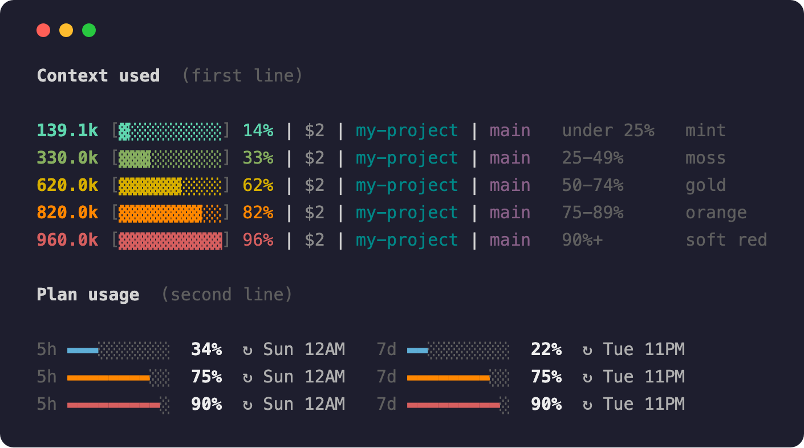

# A status line that changes colour as you run out of room

This replaces the status line of [Claude Code](https://claude.com/claude-code), the information bar at the bottom of its window. It shows how full your conversation is, and it turns from mint green to red as the conversation fills up. You can see how much room is left without reading a number.

If you have a Claude subscription, a second row shows how much of your usage limits you have used, and when they reset.



The measuring is done by [ccstatusline](https://github.com/sirmalloc/ccstatusline) by Matthew Breedlove. This project adds the colour change, the second row, and a few formatting fixes on top of it.

---

## What the parts mean

The first row:

```
139.1k [▓░░░░░░░░░] 14% | $2 | my-project | main
```

| Part | Example | What it is |
|---|---|---|
| Token count | `139.1k` | How much text Claude is holding in mind. A **token** is about three-quarters of an English word. |
| Bar and percentage | `[▓░░░░░░░░░] 14%` | How full the **context window** is. The context window is the fixed amount of text Claude can keep in mind at once. When it is full, Claude Code summarises the oldest parts to make room. |
| Cost | `$2` | What this session has cost so far, in whole dollars. |
| Folder | `my-project` | The folder you are working in. |
| Branch | `main` | The git branch, if the folder uses git. It is hidden otherwise. |

The token count, bar and percentage change colour together:

| Context used | Colour | What it means |
|---|---|---|
| under 25% | mint | lots of room |
| 25–49% | moss | comfortable |
| 50–74% | gold | over half gone |
| 75–89% | orange | start thinking about wrapping up |
| 90% and over | soft red | nearly full |

The second row:

```
5h ▬▬░░░░░░░░  17%  ↻ 3PM   7d ▬▬▬▬░░░░░░  38%  ↻ Tue 6AM
```

| Part | Example | What it is |
|---|---|---|
| Label | `5h`, `7d` | The 5-hour limit on the left, the weekly limit on the right. |
| Bar and percentage | `▬▬░░░░░░░░  17%` | How much of that limit you have used. The bar is blue, turns orange at 75%, and turns red at 90%. |
| Reset time | `↻ 3PM` | The clock time the limit resets. It shows a weekday (`Tue 6AM`) if the reset is later this week, and a date (`Sep 17`) if it is a week or more away. |

The second row does not appear until Claude has replied once in the session, because Claude Code does not know your usage before then. It never appears for accounts without subscription limits, such as API-key accounts. To turn it off for good, set `CCRAMP_PLAN_LINE=off` in the environment Claude Code starts in.

---

## What you need

- **[Claude Code](https://claude.com/claude-code)**, installed and working.
- **[Node.js](https://nodejs.org)** version 14 or newer. Node.js is a program that runs JavaScript outside a web browser, and ccstatusline needs it. If you do not have it, install the "LTS" version from its website.
- **macOS or Linux.** On Windows, it works inside WSL (Windows Subsystem for Linux), but not in plain PowerShell.

You do not need to install ccstatusline yourself, because the installer does it for you.

---

## Installing

Pick one option.

### Option 1 — ask Claude Code to do it

This needs no terminal. Open Claude Code in any folder and paste this:

```
Please install the status line from https://github.com/panuakdet-gmail/claude-statusline-ramp.

1. Download the repository, with its full history, to a temporary folder.
2. If ~/.claude/statusline-wrapper.sh already exists, and it matches no version of statusline-wrapper.sh that was ever published in this repository, I have edited it. Copy it to ~/.claude/statusline-wrapper.sh.mine-<today's date> before you go on, and tell me.
3. Run install.sh from the download and tell me if anything goes wrong. If Node.js is missing, tell me how to install it instead of installing it yourself.
4. Run preview-ramp.sh and preview-plan.sh so I can see the colours.
5. If you saved a copy of my edited file in step 2, show me what I had changed and offer to put those changes into the new version.
6. Delete the temporary download.
```

Claude Code asks your permission before it changes anything. The installer only writes to your own Claude Code settings, and it backs up any file it replaces.

To update later, send the same prompt again.

### Option 2 — run the installer yourself

Download this repository, open Terminal in its folder, and run:

```bash
./install.sh
```

The installer checks for Node.js, installs ccstatusline if it is missing, copies two files into place, and tells Claude Code to use them. It backs up any file it replaces and prints where the backups went. You can run it again safely.

If Terminal says `permission denied`, run this once and try again:

```bash
chmod +x install.sh uninstall.sh preview-ramp.sh preview-plan.sh
```

Running the installer again replaces `~/.claude/statusline-wrapper.sh`. If you changed the colours in that file, copy it somewhere first.

### Option 3 — do it by hand

1. Install ccstatusline: `npm install -g ccstatusline`
2. Copy `ccstatusline-settings.json` to `~/.config/ccstatusline/settings.json`.
3. Copy `statusline-wrapper.sh` to `~/.claude/statusline-wrapper.sh`, then run `chmod +x ~/.claude/statusline-wrapper.sh`.
4. In `~/.claude/settings.json`, add or replace this entry:

```json
"statusLine": {
  "type": "command",
  "command": "/Users/YOUR-USERNAME/.claude/statusline-wrapper.sh"
}
```

Write the full path. This setting does not understand `~`.

---

## Using it

Start a new Claude Code session. The status line appears at the bottom and updates as you work.

To see every colour at once, without waiting for a long conversation, run these in the repository folder:

```bash
./preview-ramp.sh    # the first row, in every colour band
./preview-plan.sh    # the second row, in every colour band and reset-time format
```

Both scripts send made-up figures through the real status line script, so what they show is what you will get.

---

## Changing the colours

Open `statusline-wrapper.sh` and find this block:

```perl
my $ramp = $pct >= 90 ? "38;5;167"   # soft red   #D75F5F
         : $pct >= 75 ? "38;5;208"   # orange     #FF8700
         : $pct >= 50 ? "38;5;178"   # gold       #D7AF00
         : $pct >= 25 ? "38;5;107"   # moss       #87AF5F
         :              "38;5;79";   # mint       #5FD7AF
```

The numbers `90`, `75`, `50` and `25` are the percentages where the colour changes. In `38;5;NNN`, `NNN` is a terminal colour number from 0 to 255. Save the file, and the next redraw uses the new colours. To see all 256 colour numbers, run:

```bash
for i in {0..255}; do printf '\e[38;5;%dm %3d \e[0m' "$i" "$i"; done; echo
```

The second row has its own block further down the same file, starting with `my $fill`.

To change the order of the items in the first row, run `ccstatusline` to open its editor. Keep the token count, bar and percentage in the same colour as each other, and do not give that colour to anything else. The script finds those three items by their shared colour, so otherwise the wrong items change colour.

---

## Removing it

```bash
./uninstall.sh
```

This puts back the files the installer replaced, or removes them if there was nothing before. It leaves ccstatusline installed. To remove that too, run `npm uninstall -g ccstatusline`.

---

## When something looks wrong

**The status line is blank.** The script printed nothing. Run it directly to see the error: `~/.claude/statusline-wrapper.sh < /dev/null`

**It says "ccstatusline not found".** Run `npm install -g ccstatusline`, or run `./install.sh` again.

**It says "ccstatusline produced no output".** ccstatusline cannot find Node.js. Check that `node --version` works. If it works in Terminal but the status line still complains, install Node.js from [nodejs.org](https://nodejs.org) instead of through a version manager.

**Nothing is coloured.** Run the colour-listing command above. If it prints coloured numbers, your terminal supports colour and the problem is elsewhere.

**The bars show boxes or question marks.** Your terminal font does not have the `▓`, `░` or `▬` characters. Menlo, SF Mono, JetBrains Mono and Fira Code all have them.

**The second row never appears.** Send Claude a message and look again, because the row stays hidden until Claude replies once. Also check that `CCRAMP_PLAN_LINE` is not set to `off`.

**The colours never change.** The token count, bar and percentage no longer share one colour, or another item uses the same colour. See "Changing the colours" above.

---

## Credits

[**ccstatusline**](https://github.com/sirmalloc/ccstatusline) by Matthew Breedlove measures the session and draws the first row. This project calls it and edits its output. No ccstatusline code is included here. ccstatusline is released under the MIT licence, and it has many more features than this project uses, so it is worth a look on its own.

## Licence

MIT — see [LICENSE](LICENSE). The licence covers the files in this repository. It does not cover ccstatusline, which has its own licence.
